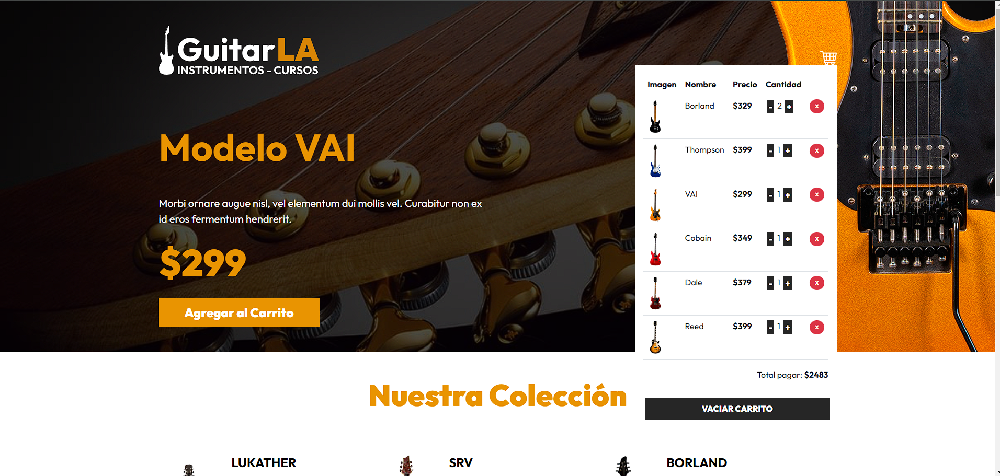

# Vue 3 + Vite
Primer proyecto usando Vue

Link del proyecto: https://guitarla-vue-carrito.netlify.app/

# GuitarLA-Vue-carrito
En este proyecto se aborda el problema y la situación de crear un carrito de compras dinamico y que se mantenga en memoria usando el local storage.

Durante este proyecto se aprendió y se realizó lo siguiente: 

- Componentes 
- State con ref y Reactive aunque en este proyecto se usa solo ref
- Eventos 
- Custom Events
- Props 
- Emits 
- Directivas 
- watch
- Computed 

---
# Vista general del proyecto



---

# Documentación 

para poder instalar las dependencias y poder trabajar, contribuir o mejorar este proyecto, basta con hacer un fork a este repositorio y usar este comando

``` node
npm i  
```

---

### Las tecnologías usadas en este proyecto son las siguientes: 

- nodejs v22.1.0
- Vue v3.4.27
- vite v5.2.0